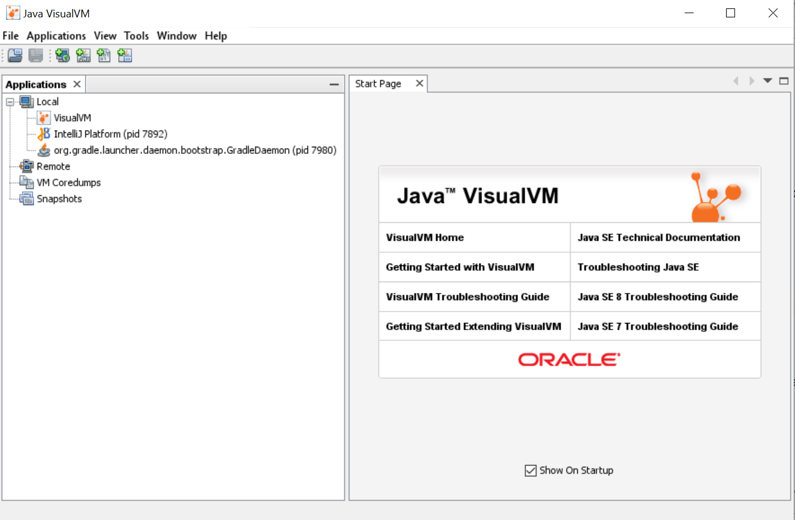
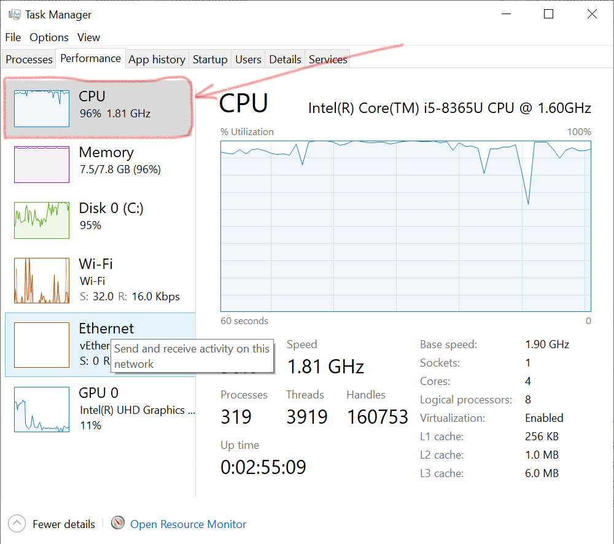
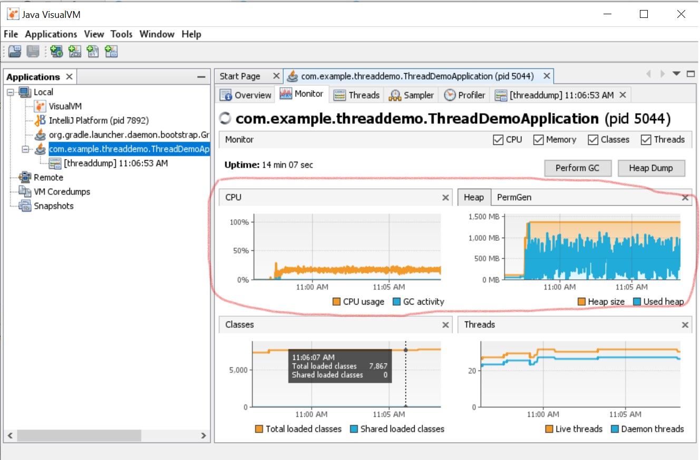
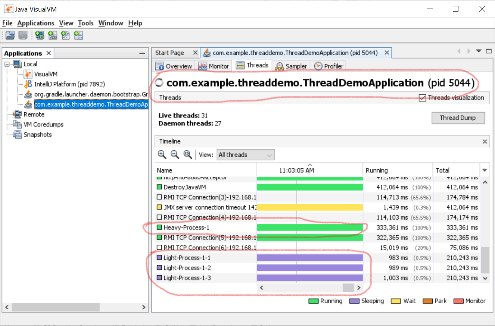
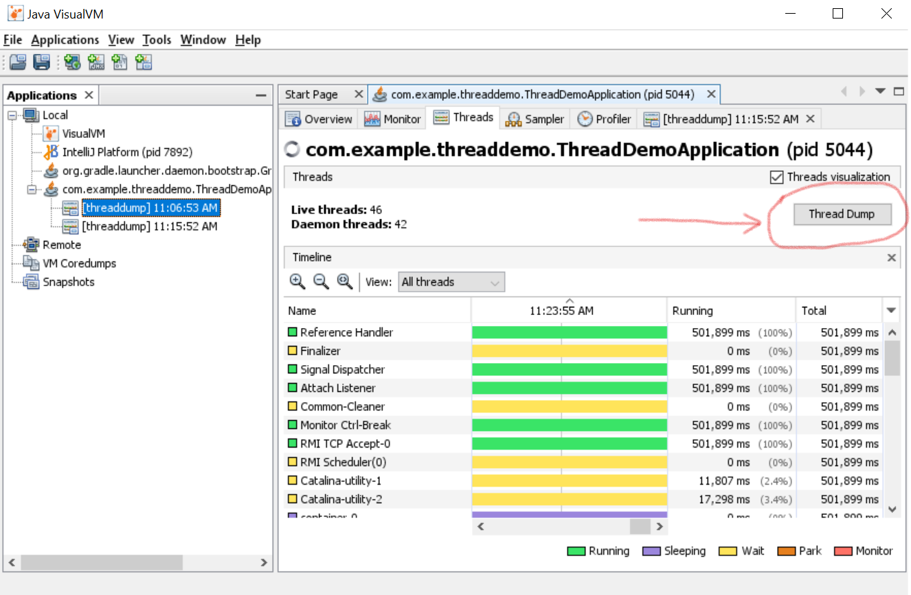
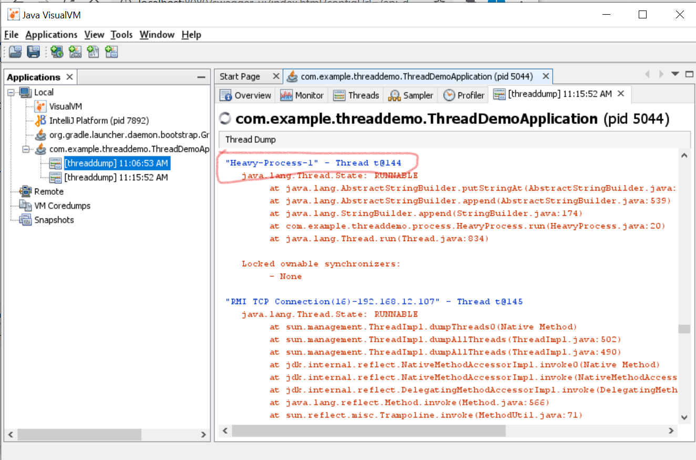
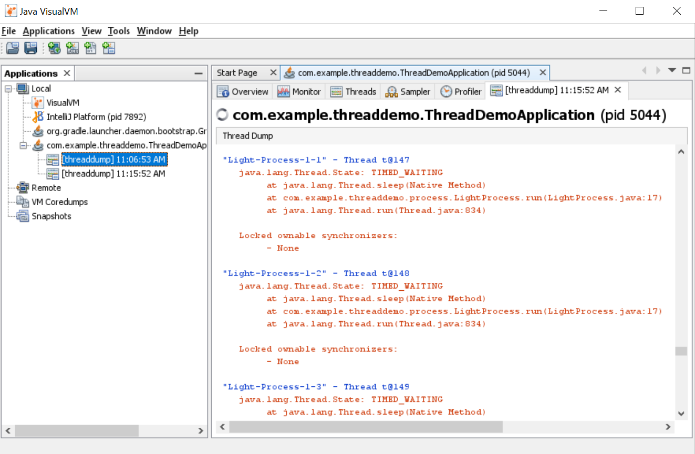
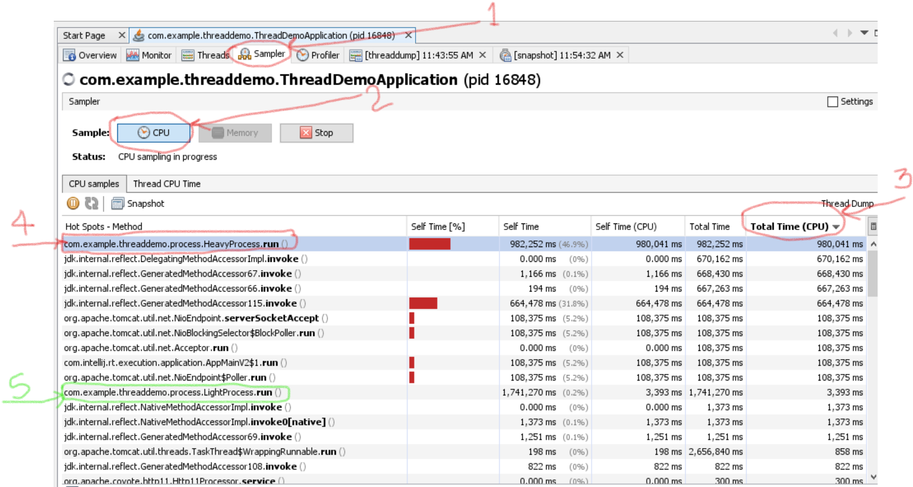

# Java Visual VM Demo

This example demonstrates the use of Java Visual VM for monitoring the utilization of CPU by java processes and figuring out the Hot-Spot method for high resource utilizing Java function / code.

## About the source code -

This code is just a dummy application that simulates PROD like situations where we may have number of heavy and light processes executing. 
It is a Spring Boot application that provides two endpoints for spawning heavy and light application processes.

## Steps to use the tool and start monitoring -

1. Go to java installation folder and then go inside "bin" directory
  ######
    cd <java_installation_path>/bin
    
2. Locate and execute the file jvisualvm 
  ######
    ./jvisualvm
  OR for Windows
  ######
    jvisualvm.exe

3. If you do not have jvisualvm - download it from https://visualvm.github.io/download.html, extract the zip distribution and locate jvisualvm in bin directory, execute the jvisualvm as in step 2
  ######
    cd <jvisualvm_installation_path>/bin

> Post Java 8, jvisualvm is not part of the Java distribution, so if you are using Java 9 or higher, you will need to explicitly download it from their official github link given above.

4. You should be seeing this window - 
 

## Steps for Troubleshooting - 

**Follow these steps to find out which application / thread / java function is utilizing the CPU most causing it to max out and go 100%**

1. Go to jvisualvm, and open the stats for our application. **Check for the name of your application(full qualified name)** in the list in left hand panel, in this example , it is **"com.demo.threaddemo.ThreadDemoApplication"**. Double-click on the name to open the stats for this appkication.

2. Click on "Monitor" tab to see various JVM related stats

3. To check which threads are currently active, click on "Threads" tab.
We can see the list of threads spawned by our application. 

 
**4. To check thread dumps -** 
    
    4.1. Click on the "Thread Dump" button.

    
    4.2. Dumps are opened in new tab, after navigating to this new tab, we can see thread dumps for our application

 
**5. To determine which java code is causing spikes in CPU utilization, we can follow these steps -** 
 
 
    5.1. Click on "Sampler" tab.
    5.2. Click on CPU button.
    5.3. Sort the list by "Total Time (CPU)" property.
    5.4. We can see that HeavyProcess.run() is utilizing the CPU for most of the time and hence causing spike in total CPU consumption for our machine. 
    5.5. Also, see that LightProcess.run() is also listed here, but it is not utilizing the CPU for that much, so it is down in the list (marked with green)
    
### Conclusion - 
Here we can see that jvisualvm can be a great artillery in our arsenal if  we run into such situations where resources are being utilized over capacity, and we need to figure out the root cause of the same. 
